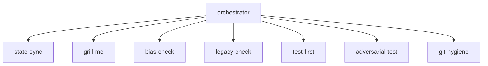
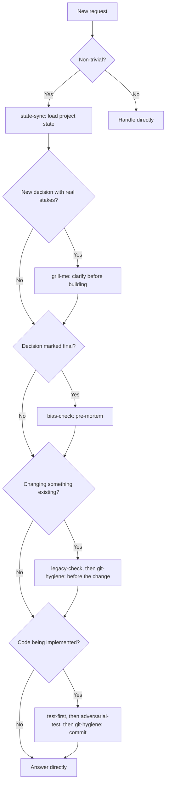

# The Discipline Stack

Eight small, focused skills that turn "being careful during AI-assisted development" into something that happens on a schedule, instead of something you have to remember every time.

This repo is the reference implementation behind "The Discipline Stack," a five-part article series on structural failure modes in AI-assisted development and the process skills that catch them. See [docs/series-index.md](docs/series-index.md) for the full series.

## The idea

Most reliability problems in AI-assisted coding trace back to missing process, not to the model itself. A model that forgets an earlier decision, agrees too easily, or grades its own work is usually just missing a step in between: something that checks the work before it gets trusted.

The Discipline Stack adds that step, split into eight components: one dispatcher and seven specialists. None of them are clever on their own. Ask a real question before committing to a plan. Check a decision for the shape of a blind spot. Write down what happened and why, immediately. Look at what's already there before changing it. Prove something works instead of assuming it does. Try to break your own proof. Keep changes committed instead of scattered across backup files. None of that is a discovery. It's what careful engineering already meant, made to happen reliably.

## Architecture

The orchestrator is the only thing that decides what happens. The seven specialists never call each other and never assume another one already ran. Each does its own job, fully, whenever the orchestrator calls it.

## Dispatch logic

## The eight skills

Before you build:

- `grill-me`: questions a plan for assumptions and gaps before anything gets built
- `bias-check`: checks a decision marked final for confirmation bias, sunk cost, and anchoring

During and after:

- `state-sync`: maintains a technical state file and a narrative journal per project
- `legacy-check`: surfaces dependencies in existing code before it gets changed
- `test-first`: requires proof of correctness before anything counts as done
- `adversarial-test`: tries to break a proof that was just delivered
- `git-hygiene`: keeps changes committed instead of backed up as loose files

The dispatcher:

- `orchestrator`: decides, for every request, which of the seven specialists apply

## A known limit

This is self-imposed discipline through instruction-following, not an externally enforced rule. Nothing here is a hook or a CI gate that physically prevents a skipped check. It works as well as the assistant actually follows its own instructions in a given session. The article series goes into where and why that can fail, including a case for the `state-sync` skill's narrative journal and one for `adversarial-test` running inside the same context window it's checking.

## Background

This repo accompanies a five-part article series. See [docs/series-index.md](docs/series-index.md) for links.

For the full background, including the research behind each skill, the honest objections, and where the stack breaks down, see the whitepaper: [docs/whitepaper.pdf](docs/whitepaper.pdf).

## Installation

See [INSTALL.md](INSTALL.md).

## License

See [LICENSE](LICENSE).
